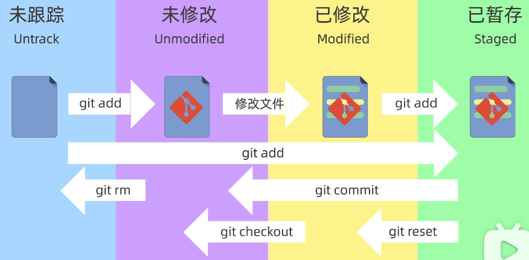
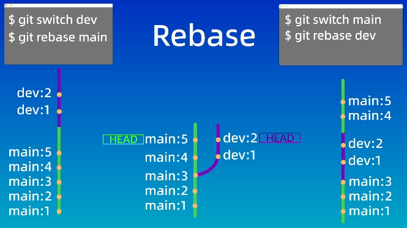
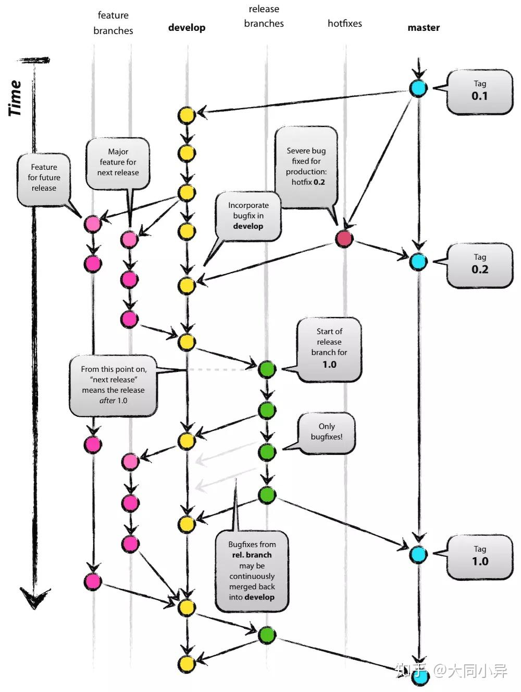

# Git
## 一、创建仓库
- 创建仓库目录，然后初始化
- repository <- 仓库，后文都已它为仓库目录，其他名称也可以
```
mkdir repository
cd repository
git init [repository]
```
这样会在仓库下得到 <kbd>.git</kbd> 文件夹，里面有配置文件，以及版本库文件。
## 二、文件
- .git ：Working Directory <- 工作区
- .git/index : Staging Area <- 暂存区
- .git/objects : Objects <- 对象库,本地仓库



<div style="display: flex;">
    <div style="width: 20%;">
        git status<br>git add<br>git commit<br>git log
    </div>
    <div style="width: 70%;">
        查看文件状态<br>添加文件到暂存区<br>提交文件到本地仓库<br>查看提交信息
    </div>
</div>
git commit -a -m "message" 一次完成暂存和提交两个动作。也可写git commit -am "message"

### log
<div style="display: flex;">
    <div style="width: 20%;">
        --graph<br>--oneline<br>--decorate<br>--all
    </div>
    <div style="width: 70%;">
        : 显示图形化提交信息<br>: 显示一行提交信息<br>: 显示提交信息<br>: 显示所有分支
    </div>
</div>

- 给长指令取别名
    - alias git-log="git log --graph --oneline --decorate --all"
    - alias graph="git log --graph --oneline --decorate --all"

### git reset 回退到某个版本
1. --soft 保留工作区和暂存区的所有修
2. --hard 丢弃工作区和暂存区的所有修改
3. --mixed 只保留工作区，丢弃暂存区
### git diff 比较工作区和暂存区的文件差异
- git diff --staged : 比较暂存区和本地仓库的差异
- git diff --cached : 比较暂存区和本地仓库的差异
- git diff HEAD : 比较工作区和本地仓库的差异
- git diff version1 version2 : 比较两个版本之间的差异
- git diff Head~ Head : 比较当前版本和前一个版本的差异
    - 等价于 git diff Head^ Head
    - git diff Head~3 Head : 比较当前版本和前3个版本的差异
    - git diff Head^ Head file2.txt 只查看file2.txt
- git diff --name-only : 只显示文件名
- git diff 分支1 分支2 : 比较两个分支的差异

### 删除文件
- git rm file1.txt 删除工作区和暂存区的file1.txt
- git rm --cached file1.txt 删除工暂存区的file1.txt,保留工作区
- git rm -r* 递归删除所有子目录和文件，需要手动提交

## 三、.gitignore
- 忽略文件，不会提交到本地仓库

## 四、远程仓库
1. https方式
2. ssh方式
    1. 进入 .shh 目录
    1. ssh-keygen -t rsa -b 4096  生成密钥
        - 会在user文件夹下生成 id_rsa 的密匙文件
        - 每次生成建议用新名字

- 添加远程仓库
    - git remote add origin https://github.com/username/repository.git
- 查看远程仓库的别名和地址
    - git remote -v
- 指定分支名称为 main
    - git branch -M main
- 把本地的main分支与远程仓库的main分支关联
    - git branch -u origin/远程分支 [本地分支]
    - git branch --set-upstream-to=origin/demo
    - git push -u origin main 本地和远程都叫main
    - git push -u origin main:master 本地叫main，远程叫master
- 查看分支关联情况
    - git branch -vv

### push 和 pull
- push : 把本地仓库的提交推送到远程仓库
- pull : 把远程仓库的提交拉到本地仓库
    - git pull <远程主机名> <远程分支名>:<本地分支名> 把远程分支拉取并合并到本地分支
## 五、分支
- 查看分支
    - git branch
- 创建分支
    - git branch 分支名
- 切换分支
    - git checkout 分支名
    - git switch 分支名(2.23版本后)
- 合并分支
    - git merge 分支名 把分支名合并到当前分支
- 删除分支
    - git branch -d 分支名(删除合并后的分支)
    - git branch -D 分支名(强制删除未合并的分支)

### merge冲突
- 终止合并
    - git merge --abort
- 解决
    - 可以使用git diff查看冲突内容，然后手动修改
    - 然后add，commit就行

### rebase
git rebase 分支名
- 把当前分支的提交历史，放到分支名分支的提交历史后面，然后切换到分支名分支，然后commit



## 六、回退
- 回退到某个版本
    - git reset --hard 版本号

## 七、GitFlow
